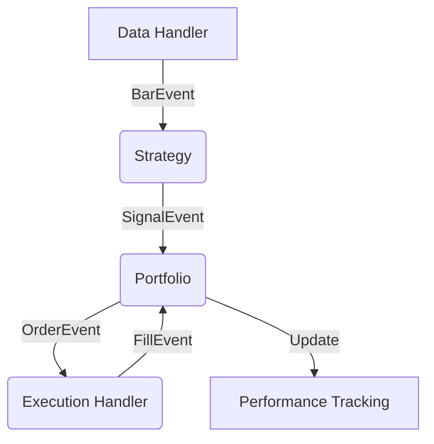

# 🚀 Advanced Event-Driven Backtesting Engine v2.0

A professional-grade, event-driven backtesting system for algorithmic trading.## 🚀 Core Features & Capabilities

### ⚡ Event-Driven Engine
- **Queue-Based Architecture**: High-performance, asynchronous event loop (`BarEvent` → `SignalEvent` → `OrderEvent` → `FillEvent`).
- **Zero Look-Ahead Bias**: Strictly processes data bar-by-bar to ensure realistic simulation.
- **Micro-Slippage Modelling**: Accounts for market spreads and execution delays.

### 🧠 Intelligent Strategies
- **Multi-Strategy Runner**: Coordinate multiple algorithms with logic-based gating.
- **Market Regime Detection**: Built-in ADX/ATR models to identify `TRENDING`, `RANGING`, or `VOLATILE` regimes.
- **Built-in Library**:
  - `Momentum Alpha`: Trend-following with volatility adjustments.
  - `Mean Reversion`: Reversion logic using Bollinger Bands.
  - `RSI/MACD`: Industry-standard technical oscillators.
  - `ML-Ready`: Extensible `AlphaModel` class for machine learning integrations.

### 🛡️ Enterprise Risk Management
- **Dynamic Risk Manager**: Per-trade Stop-Loss and Take-Profit execution.
- **Leverage Multiplier**: User-defined leverage (up to 10x) with real-time margin tracking.
- **Drawdown Protection**: Global portfolio drawdown caps to prevent "blown accounts".
- **Execution Cost Modeling**: Custom commission tiers (0% to 1.0%) per execution.

### 📊 Professional Analytics
- **Live Performance Dashboard**: Equity curves vs. Benchmark (SPY).
- **Monthly Return Heatmaps**: Visual grid of monthly/yearly performance.
- **Risk Distribution**: Histogram charts of trade profits and losses.
- **Advanced Metrics**: Integrated `riskstats.py` for CAGR, Sharpe, Sortino, Calmar, and Expectancy.

### 🛠️ Interactive Developer Tools
- **Global Ticker Search**: Search and backtest **any global asset** via real-time `yfinance` integration.
- **In-Browser IDE**: Write and save custom Python strategies directly in the dashboard.
- **Parameter Tuning**: Dynamic sliders for instant "what-if" analysis on strategy settings.
- **Data Caching**: Automated local storage for lightning-fast subsequent runs.

## 📸 Visual Walkthrough

````carousel

**Dashboard Overview**: Real-time equity curves, drawdown analysis, and dynamic strategy configuration.
<!-- slide -->

**Deep Analytics**: Monthly returns heatmap, return distribution histograms, and advanced risk metrics (Sharpe, Sortino, Calmar).
<!-- slide -->

**Comprehensive Trade Log**: Detailed execution history with P&L tracking, duration, and side-by-side performance metrics.
<!-- slide -->

**Live Strategy Editor**: Integrated development environment with real-time variable references and one-click backtesting.
````

## ⚙️ Architecture & The Event Loop

The engine utilizes a high-performance **Event-Driven Architecture**, mimicking the asynchronous nature of live trading desks. This ensures zero "look-ahead bias" and realistic execution.



### Key Components:
- **`complete_backtest_system.py`**: The central orchestrator managing the event queue (`Queue.Queue`).
- **`RiskManager`**: Validates all orders against portfolio drawdown and leverage limits before execution.
- **`SimulatedExecutionHandler`**: Models slippage, spread, and transaction fees (Commission).

## 👩‍💻 Custom Strategy Development

You can write your own strategies directly in the dashboard. Here is a quick reference for the available variables:

| Variable | Description | Example |
| :--- | :--- | :--- |
| `pd`, `np` | Standard Python libraries for data analysis. | `df = pd.DataFrame(...)` |
| `bars` | Access to historical data for all symbols. | `self.bars.get_latest_bars(syn, N=1)` |
| `events` | The central event queue to push signals. | `self.events.put(SignalEvent(...))` |
| `Strategy` | The base class your strategy must inherit. | `class MyStrategy(Strategy):` |

### Signal Types:
- **`LONG`**: Open a new buyer position.
- **`SHORT`**: Open a new seller position.
- **`EXIT`**: Close out all active positions for the ticker.

## 🛠️ Installation & Setup

1. **Environment Initialization**:
   ```bash
   source .venv/bin/activate
   # OR use: .venv/bin/python3
   ```

2. **Backend API**:
   ```bash
   python3 backtest_api.py
   ```

3. **Frontend Dashboard**:
   ```bash
   cd dashboard
   npm install
   npm run dev
   ```

---
*Built for quantitative traders who value realism and automation.*
