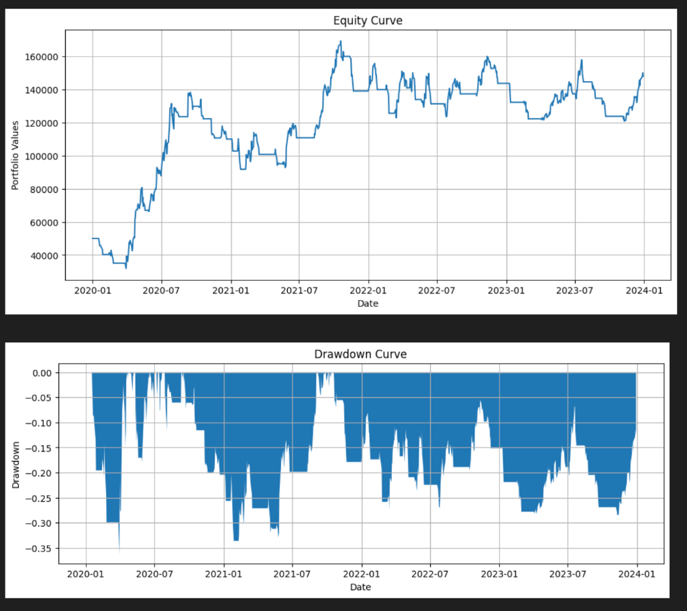
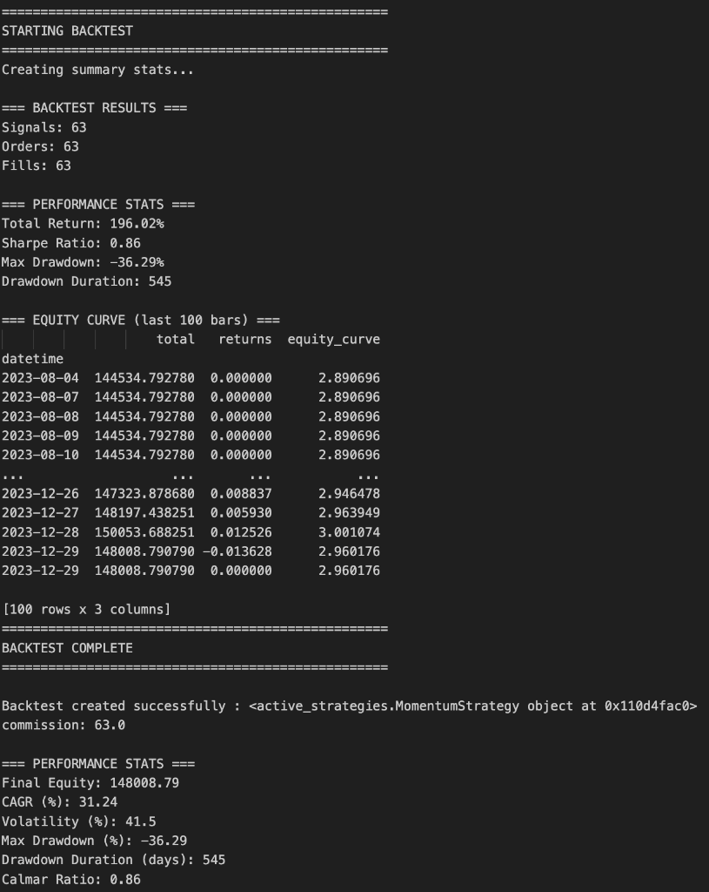

# Event-Driven Backtesting Engine


A comprehensive, event-driven backtesting system written in Python. This engine allows you to test various trading strategies against historical data with realistic simulation of order execution, commission costs, and portfolio tracking.

## 🚀 Features

*   **Event-Driven Architecture**: Simulates the flow of real-time trading systems (Market -> Signal -> Order -> Fill).
*   **Multiple Strategies**: Includes built-in implementations of popular strategies:
    *   **Buy and Hold**: Benchmark strategy.
    *   **Moving Average Crossover**: Trend-following using dual MAs.
    *   **Mean Reversion**: Bollinger Band-based strategy.
    *   **Momentum**: Rate of Change (ROC) based trading.
    *   **RSI**: Oscillator-based strategy for overbought/oversold conditions.
    *   **Rebalancing**: Periodic portfolio adjustment.
*   **Robust Portfolio Management**: Tracks cash, positions, holdings, and total equity over time.
*   **Realistic Execution**: Simulates fills, slippage (0.05%), and commission costs (Indian Equity Delivery model support).
*   **Performance Metrics**: detailed analysis including CAGR, Volatility, Max Drawdown, Sharpe Ratio, and Calmar Ratio.
*   **Visualization**: Built-in plotting for Equity Curves and Drawdowns.
*   **Data Tools**: Integrated script to download historical data from Yahoo Finance.

## 📂 Project Structure

```
├── complete_backtest_system.py  # Main engine and backtest runner
├── active_strategies.py         # Collection of trading strategies
├── riskstats.py                 # Risk metrics and performance visualization
├── download_stock_data.py       # Helper to download OHLCV data
├── data/                        # Directory for CSV data files
└── requirements.txt             # Project dependencies
```

## 🛠️ Installation

1.  Clone the repository:
    ```bash
    git clone https://github.com/shreyanshxt/Backtesting_engine.git
    cd Backtesting_engine
    ```

2.  Create and activate a virtual environment (optional but recommended):
    ```bash
    python -m venv venv
    source venv/bin/activate  # On Windows: venv\Scripts\activate
    ```

3.  Install dependencies:
    ```bash
    pip install numpy pandas matplotlib scipy yfinance
    ```

## 📊 Usage

### 1. Download Data
First, fetch historical data for your target assets.
Edit `download_stock_data.py` to set your desired symbols and date range, then run:

```bash
python download_stock_data.py
```
This will create `.csv` files in the `data/` directory.

### 2. Configure Backtest
Open `complete_backtest_system.py` and modify the "Configuration" section at the bottom:

```python
# Configuration
csv_dir = './data'
symbol_list = ['RELIANCE.NS']
initial_capital = 100000.0
start_date = datetime.datetime(2020, 1, 1)
end_date = datetime.datetime(2023, 12, 31)

# Select Strategy
# Import from active_strategies if needed
backtest = Backtest(
    ...,
    strategy=MomentumStrategy  # Change this to your desired strategy
)
```

### 3. Run Simulation
Execute the main script to start the backtest:

```bash
python complete_backtest_system.py
```

### 4. View Results
The script will output performance statistics to the console and generate plots for the Equity Curve and Drawdown.

```text
=== BACKTEST RESULTS ===
Signals: 15
Orders: 15
Fills: 15

=== PERFORMANCE STATS ===
Total Return: 45.2%
Sharpe Ratio: 1.25
Max Drawdown: 12.5%
...
```

## � Example Results

Here's an example backtest run using the **Momentum Strategy** on RELIANCE.NS (2020-2023):

### Performance Visualizations


### Backtest Statistics


**Key Metrics:**
- **Total Return**: 196.02%
- **CAGR**: 31.24%
- **Sharpe Ratio**: 0.86
- **Max Drawdown**: -36.29%
- **Signals Generated**: 63
- **Commission Paid**: ₹63.0

## �📈 Supported Strategies
You can switch strategies in `complete_backtest_system.py` by importing from `active_strategies.py`:

```python
from active_strategies import MovingAverageCrossStrategy, RSIStrategy

# Use inside Backtest class initialization:
strategy=MovingAverageCrossStrategy
```

## 🤝 Contributing
Contributions are welcome! Please feel free to submit a Pull Request.

## 📝 License
This project is licensed under the MIT License.
