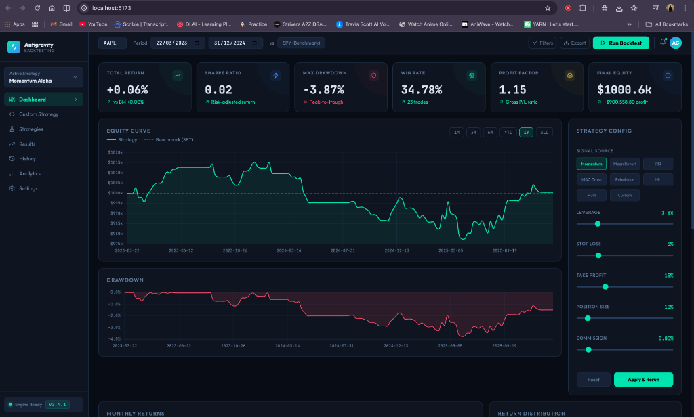
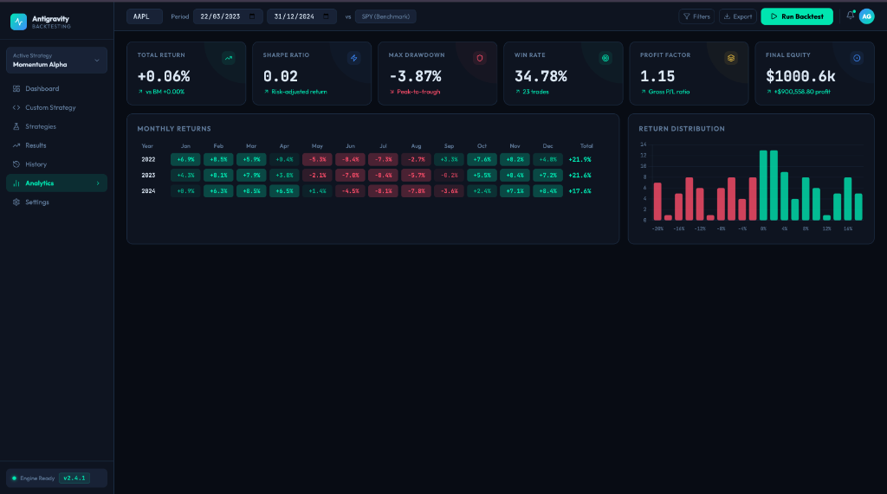
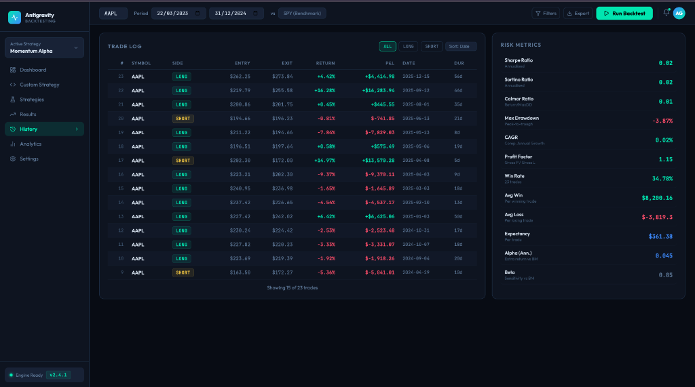
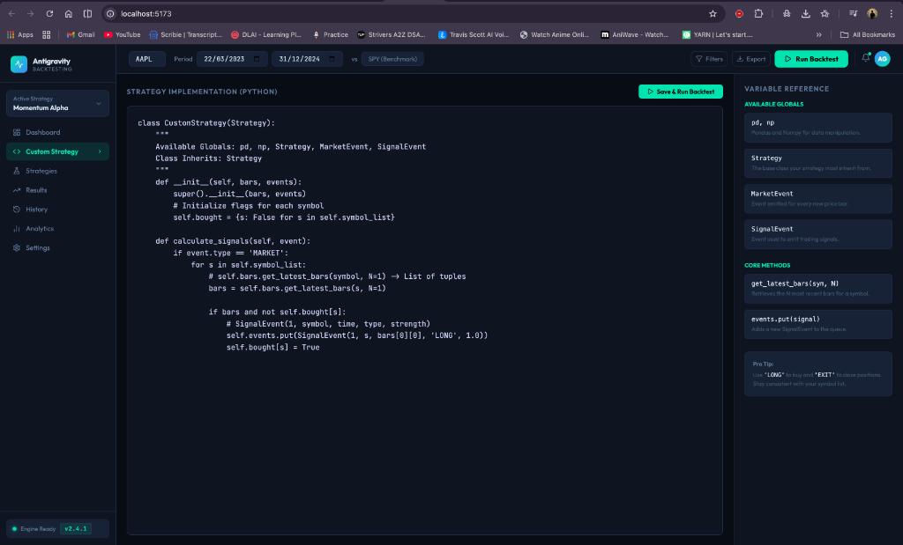
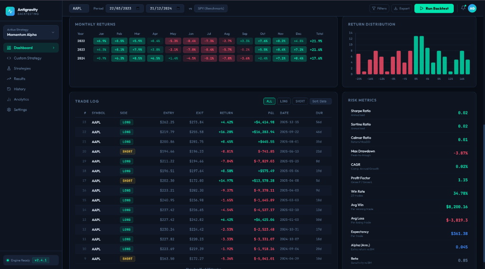
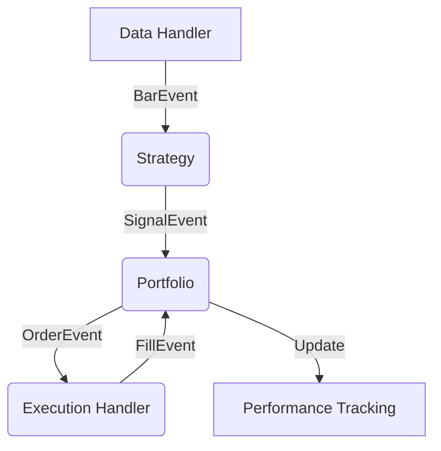

# Advanced Event-Driven Backtesting Engine v2.0

A professional-grade, event-driven backtesting system for algorithmic trading. This engine provides a high-fidelity simulation environment with zero look-ahead bias, real-time data fetching, and an interactive modern dashboard.

## Core Features & Capabilities

### Event-Driven Engine
- **Queue-Based Architecture**: High-performance, asynchronous event loop (`BarEvent` → `SignalEvent` → `OrderEvent` → `FillEvent`).
- **Zero Look-Ahead Bias**: Strictly processes data bar-by-bar to ensure realistic simulation.
- **Micro-Slippage Modelling**: Accounts for market spreads and execution delays.

### Intelligent Strategies
- **Multi-Strategy Runner**: Coordinate multiple algorithms with logic-based gating.
- **Market Regime Detection**: Built-in ADX/ATR models to identify `TRENDING`, `RANGING`, or `VOLATILE` regimes.
- **Built-in Library**:
  - `Momentum Alpha`: Trend-following with volatility adjustments.
  - `Mean Reversion`: Reversion logic using Bollinger Bands.
  - `RSI/MACD`: Industry-standard technical oscillators.
  - `ML-Ready`: Extensible `AlphaModel` class for machine learning integrations.

### Enterprise Risk Management
- **Dynamic Risk Manager**: Per-trade Stop-Loss and Take-Profit execution.
- **Leverage Multiplier**: User-defined leverage (up to 10x) with real-time position scaling.
- **Drawdown Protection**: Global portfolio drawdown caps to prevent significant losses.
- **Execution Cost Modeling**: Custom commission tiers (0% to 1.0%) for realistic friction.

### Professional Analytics
- **Live Performance Dashboard**: Equity curves vs. Benchmark (SPY).
- **Monthly Return Heatmaps**: Visual grid of monthly/yearly performance.
- **Risk Distribution**: Histogram charts of trade profits and losses.
- **Advanced Metrics**: CAGR, Sharpe, Sortino, Calmar, and Expectancy.

### Interactive Developer Tools
- **Global Ticker Search**: Backtest **any global asset** via real-time `yfinance` integration.
- **In-Browser IDE**: Write and save custom Python strategies directly in the dashboard.
- **Parameter Tuning**: Dynamic sliders for instant "what-if" analysis on strategy settings.
- **Automated Data Caching**: Intelligent local storage for lightning-fast subsequent runs.

## Visual Walkthrough

````carousel

**Dashboard Overview**: Real-time equity curves, drawdown analysis, and dynamic strategy configuration.
<!-- slide -->

**Deep Analytics**: Monthly returns heatmap, return distribution histograms, and advanced risk metrics.
<!-- slide -->

**Comprehensive Trade Log**: Detailed execution history with P&L tracking and performance metrics.
<!-- slide -->

**Live Strategy Editor**: Integrated development environment with real-time variable references.
<!-- slide -->

**Combined Analytics**: A unified view of strategy performance, trade distribution, and monthly heatmaps.
````

## Strategy Stress Testing & Customization

The engine is built for deep experimentation. It allows you to move beyond static backtests and perform **Dynamic Sensitivity Analysis**:

### 1.Live Strategy Playground
Don't just use the built-in algos—**write your own**.
- **In-Browser IDE**: Integrated Python editor for rapid prototyping.
- **Instant Execution**: One-click "Save & Run" to see your logic's performance on live market data.
- **Developer Guide**: Comprehensive variable reference guide included in the dashboard.

### 2. Dynamic Parameter Sensitivity
Perform "What-If" analysis by stress-testing your strategy against realistic market frictions:
- **Leverage Stress**: See how your strategy behaves at 1x vs 10x leverage (verified position scaling logic).
- **Commission Erosion**: Simulate how transaction costs and "slippage" eat into your net profit.
- **Risk Tuning**: Fine-tune individual Stop-Loss and Take-Profit thresholds to find the "Goldilocks" zone for your strategy.

## Architecture & The Event Loop

The engine mimics the asynchronous nature of live trading desks. This ensures that every trade is executed only after a "fill" event is confirmed by the simulated broker.



## Project Structure
- `complete_backtest_system.py`: The core orchestrator and risk engine.
- `active_strategies.py`: Professional strategy library and regime sensors.
- `backtest_api.py`: FastAPI bridge serving high-speed results to the UI.
- `dashboard/`: Premium Vite + React dashboard.
- `data/`: Automated historical CSV data storage.
- `assets/`: UI documentation and gallery resources.

## Installation & Setup

1. **Environment Initialization**:
   ```bash
   source .venv/bin/activate
   # OR use: .venv/bin/python3
   ```

2. **Launch Backend API**:
   ```bash
   python3 backtest_api.py
   ```

3. **Launch Frontend Dashboard**:
   ```bash
   cd dashboard
   npm install
   npm run dev
   ```

---
*Built for quantitative traders who value realism and automation.*
